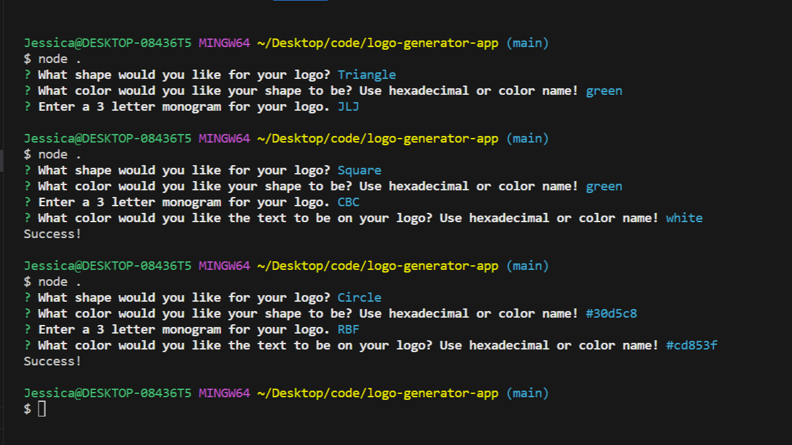

# SVG Logo Generator App

## Description

This tiny app uses the command line in node to help developers create a simple logo for their projects. Sometimes you cannot afford a graphic designer at the beginning of your project, but you still need a simple, professional logo to attach to your documents. This app can help.

## Table of Contents (Optional)

- [Installation](#installation)
- [Usage](#usage)
- [Credits](#credits)
- [License](#license)

## Installation

You must have node.js installed on your environment to use this app. The node modules that are required for this project are included in a package found in the repository. You must run `npm i` to install the node modules on your environment to run the app.

## Usage

Once you have installed the node modules you need, simply open the index in your terminal and execute the `node .` or `node index.js` command to begin the application.

Here is a link to a video walkthrough of the app in use:

Here is an example of another logo created with the app:

## Credits

I received significant help on this project from my instructor [Jon Lynch](https://www.github.com/jonnylynchy).

## License

MIT (c) 2024 Jessica Jones
[MIT License](https://mit-license.org/)